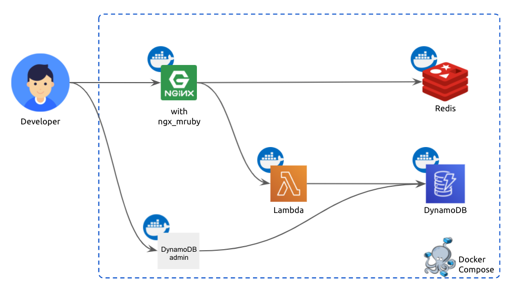

[](https://github.com/kenzo0107/ngx_mruby-ssl-dynamic-delivery/actions/workflows/test.yml) [](https://github.com/kenzo0107/ngx_mruby-ssl-dynamic-delivery/actions/workflows/lint.yml)

## 本リポジトリの目的

ngx_mruby でローカル環境で動的証明書配信を試験する。

以下論文の p4 にある設定例を参考に検証する。

[高集積マルチテナントWebサーバの大規模証明書管理](https://rand.pepabo.com/papers/iot37-proceeding-matsumotory.pdf)

## 構成図



1. ngx_mruby で SSL/TLS ハンドシェイク時にドメインを元に Redis から証明書(crt), 秘密鍵(key) を取得
    - Redis に存在しない場合は DynamoDB から取得し、 Redis にキャッシュ登録
2. 取得した crt, key を元に SSL/TLS ハンドシェイク
3. ngx_mruby でアクセスしたドメイン名を返す

簡易的に ngx_mruby を用いた証明書の動的読み込みを体験できる様な構成にしています。


## 開発環境の構築

### 1. 環境に必要なツールのインストール

- [dip](https://github.com/bibendi/dip)

### 2. プロビジョニング

```console
dip provision
```
### 3. /etc/hosts 設定

```console
echo "127.0.0.1 aaa.localhost bbb.localhost foo.example.com" | sudo tee -a /etc/hosts
```

各開発環境で利用するドメインを 127.0.0.1 に向ける。

### 4. serverの起動

```console
docker-compose up -d
```

## テスト実行

```console
dip test
```

## curl でアクセス

```console
$ curl -k https://aaa.localhost
aaa.localhost

$ curl -k https://bbb.localhost
bbb.localhost

$ curl -k https://foo.example.com
foo.example.com
```

各ドメインで証明書を動的に読み込みし、ドメイン名を返すことが確認できる。
